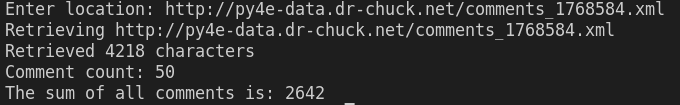

# web-services
These are my solutions to the Extracting Data from XML and JSON assignments for Chapter 13 of Python for Everybody.

## xml-extraction
The assignment was as follows:
"Write a program that will prompt for a URL, read the XML data from that URL using urllib and then parse and extract the comment counts from the XML data, compute the sum of the numbers in the file and enter the sum."

The data in the provided xml files consisted of a number of names and comment counts in XML as follows: "comments/comment/name,count"

Once I had the element tree of the xml, I parsed the individual comments and placed them in a list. From here I used a for loop to extract all of the counts within the comment items of the list and added them as integers to the sum.

I had to provide the correct sum of all comment counts in order to pass the assignment.

### Example Output:

## json-extraction
This one works essentially the same as the xml-extraction, retrieving the same data, but is simplified due to the nature of JSON.

## json-geo-api
Assignment: The program will prompt for a location, contact a web service and retrieve JSON for the web service and parse that data, and retrieve the first place_id from the JSON. A place ID is a textual identifier that uniquely identifies a place as within Google Maps.
